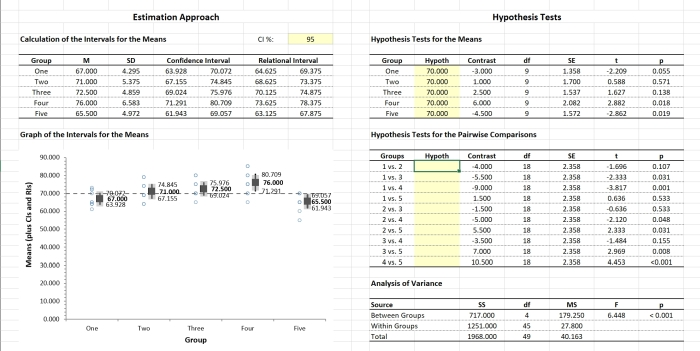

# ARISE: Arelational and Relational Interval Statistics with Excel

## Overview

**ARISE** is a set of simple Excel spreadsheets that provide real-time calculations and graph of both relational and arelational confidence intervals for means using raw data input. These statistics are not readily available in other statistics packages. It also provides null hypothesis significance tests for pairwise comparisons.

## Included Spreadsheets and Examples

The **ARISE(D)-OneWay** module is appropriate for a one-way (single factor) between-subjects design with raw data input.

- [**_ARISE(D)-OneWay.xlsx_**](./ARISE(D)-OneWay.xlsx) is a blank version of the module.
- [**_ARISE(D)-OneWay-Wendorf.xlsx_**](./ARISE(D)-OneWay-Wendorf.xlsx) analyses raw data from Wendorf (2012).

The **ARISE(D)-Repeated** module is appropriate for a one-way (single factor) within-subjects design with raw data input.

- [**_ARISE(D)-Repeated.xlsx_**](./ARISE(D)-Repeated.xlsx) is a blank version of the module.
- [**_ARISE(D)-Repeated-Wendorf.xlsx_**](./ARISE(D)-Repeated-Wendorf.xlsx) analyses raw data adapted from Wendorf (2012).

## How to Cite

Wendorf, C. A. (2014). _ARISE: Arelational and Relational Interval Statistics with Excel_ [Excel Spreadsheets]. [https://cwendorf.github.io/BASE/ARISE](../ARISE)
