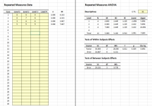

# CREATE 

### Course Resource for Editing and Analyzing Tutorials with Excel

---

## Overview

**CREATE** is a set of simple Excel spreadsheets that provide real-time calculations of basic statistics in traditional approaches to data analyses. It is appropriate for small data sets (such as course tutorials) and all simple research designs (such as one sample, paired samples, independent samples, one way, repeated measure, and factorial designs). Separate spreadsheets are available for raw data and summary statistics input.

<kbd></kbd>

## Included Spreadsheets and Examples

The **CREATE(D)-AllDesigns** module is appropriate for a all simple research designs with raw data input.

- [**_CREATE(D)-AllDesigns.xlsx_**](./CREATE(D)-AllDesigns.xlsx) is a blank version of the module.
- [**_CREATE(D)-AllDesigns-Tutorial.xlsx_**](./CREATE(D)-AllDesigns-Tutorial.xlsx) analyses tutorial raw data.

The **CREATE(S)-AllDesigns** module is appropriate for a all simple research designs with summary statistics input.

- [**_CREATE(S)-AllDesigns.xlsx_**](./CREATE(S)-AllDesigns.xlsx) is a blank version of the module.
- [**_CREATE(S)-AllDesigns-Tutorial.xlsx_**](./CREATE(S)-AllDesigns-Tutorial.xlsx) analyses tutorial summary statistics.

## How to Cite

Wendorf, C. A. (2012). _CREATE: Course Resource for Editing and Analyzing Tutorials with Excel_ [Excel Spreadsheets]. [https://cwendorf.github.io/BASE/CREATE](../CREATE)
