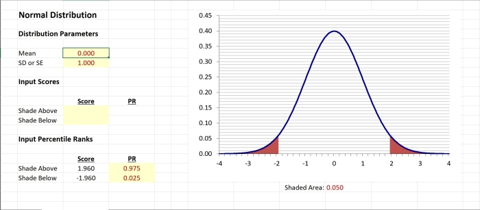

## `CRUDE` | Course Resource for Understanding Distributions with Excel

### Overview

[**CRUDE**](../CRUDE) is a simple Excel spreadsheet that displays common statistical distributions and identifies important values of the distributions. It accepts either score input (to find percentiles ranks and p values) or percentile rank input (to find critical values). It is useful for visually representing these values as part of a course in basic statistics.

<kbd></kbd>

### Materials

The **CRUDE-AllDistributions** module is appropriate for all basic distributions with score or percentile rank input.

- [*CRUDE-AllDistributions.xlsx*](./CRUDE-AllDistributions.xlsx) - A blank version of the module
- [*CRUDE-AllDistributions-Examples.xlsx*](./CRUDE-AllDistributions-Examples.xlsx) - Simple examples for each distribution

### Contact Me
 
- Author Email: [cwendorf@uwsp.edu](mailto:cwendorf@uwsp.edu)
- Author Homepage: [https://cwendorf.github.io](https://cwendorf.github.io)

### Citation

Wendorf, C. A. (2021). _CRUDE: Course Resource for Understanding Distributions with Excel_ [Excel Spreadsheets]. [https://github.com/cwendorf/BASE/tree/main/CRUDE](../CRUDE)
