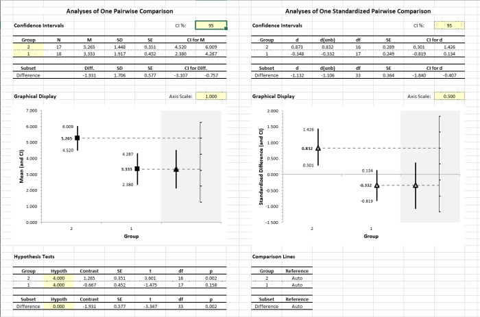

# EASE: Estimation Approach to Statistics with Excel

A set of modules in Basic Analytic Statistics with Excel (BASE)
[Home](./)

---

## Overview

**EASE** is a set of simple Excel spreadsheets that provide real-time calculations estimation statistics. These spreadsheets calculate, test, and plot confidence intervals for means, mean comparisons, and standardized effect sizes. Functions and examples are available for different single-factor designs (between-subjects vs. within-subjects) and can take either raw data or summary statistics as input. 

<kbd></kbd>

## Included Spreadsheets and Examples

The **EASE(D)-OneWay** module is appropriate for a one-way (single factor) between-subjects design with raw data input.

- [**_EASE(D)-OneWay.xlsx_**](./EASE(D)-OneWay.xlsx) is a blank version of the module.
- [**_EASE(D)-OneWay-Rattan.xlsx_**](./EASE(D)-OneWay-Rattan.xlsx) analyses raw data from Rattan (2012).

The **EASE(S)-OneWay** module is appropriate for a one-way (single factor) between-subjects design with summary statistics input.

- [**_EASE(S)-OneWay.xlsx_**](./EASE(S)-OneWay.xlsx) is a blank version of the module.
- [**_EASE(S)-OneWay-Rattan.xlsx_**](./EASE(S)-OneWay-Rattan.xlsx) analyses summary statistics from Rattan (2012).

The **EASE(D)-Repeated** module is appropriate for a one-way (single factor) within-subjects design with raw data input.

- [**_EASE(D)-Repeated.xlsx_**](./EASE(D)-Repeated.xlsx) is a blank version of the module.
- [**_EASE(D)-Repeated-Donohue.xlsx_**](./EASE(D)-Repeated-Donohue.xlsx) analyses raw data from Donohue (2002).

The **EASE(S)-Repeated** module is appropriate for a one-way (single factor) within-subjects design with summary statistics input.

- [**_EASE(S)-Repeated.xlsx_**](./EASE(S)-Repeated.xlsx) is a blank version of the module.
- [**_EASE(S)-Repeated-Donohue.xlsx_**](./EASE(S)-Repeated-Donohue.xlsx) analyses summary statistics from Donohue (2002).

## How to Cite

Wendorf, C. A. (2016). _EASE: Estimation Approach to Statistics with Excel_ [Excel Spreadsheets]. [https://cwendorf.github.io/BASE/EASE](../EASE)
