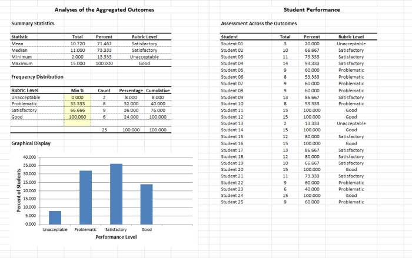

# `GREAT` 

## Grading and Embedded Assessment Tool

### Overview

[**GREAT**](../GREAT) is a set of tools that offer a strategy for embedding educational assessment into the existing graded assignments for a course. Taken together, these resources provide a simple, yet quite effective, system for assessment reporting.

<kbd></kbd>

### Materials

[*A Methodology for Embedded Assessment*](./Wendorf-EmbeddedAssessmentMethodology.pdf) describes how a repeated measures research design is appropriate to embedded assessment, yet describes the difference in analytical strategy. This is a *must read* prior to using the GREAT spreadsheet.

The **GREAT-Repeated** module is appropriate for all repeated measures embedded assessments.

- [*GREAT-Repeated.xlsx*](./GREAT-Repeated.xlsx) - A blank version of the module
- [*GREAT-Repeated-Example.xlsx*](./GREAT-Repeated-Example.xlsx) - Simple analyses and graphs for a hypothetical statistics assessment

### Citation

Wendorf, C. A. (2021). *GREAT: Grading and Embedded Assessment Tool* [Excel Spreadsheets]. [https://github.com/cwendorf/BASE/tree/main/GREAT](../GREAT)
