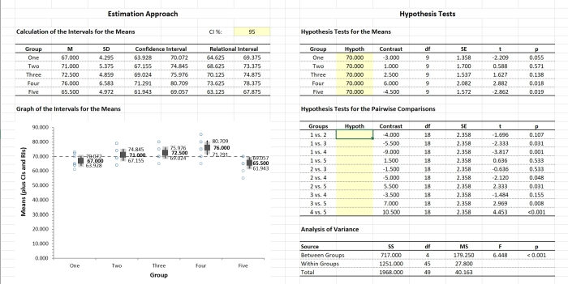
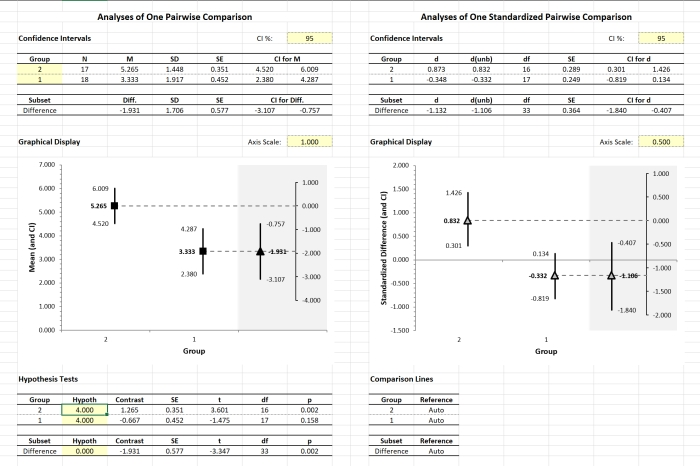

# Basic Analytical Statistics with Excel

## CREATE: Course Resource for Editing and Analyzing Tutorials with Excel

**CREATE** is a set of simple Excel spreadsheets that provide real-time calculations of basic statistics in traditional approaches to data analyses. It is appropriate for small data sets (such as course tutorials) and all simple research designs (such as one sample, paired samples, independent samples, one way, repeated measure, and factorial designs). Separate spreadsheets are available for raw data and summary statistics input.

> Wendorf, C. A. (2012). _CREATE: Course Resource for Editing and Analyzing Tutorials with Excel_ [Excel Spreadsheets]. [https://cwendorf.github.io/BASE/CREATE](./CREATE)

## ARISE: Arelational and Relational Interval Statistics with Excel

**ARISE** is a set of simple Excel spreadsheets that provide real-time calculations and graph of both relational and arelational confidence intervals for means using raw data input. These statistics are not readily available in other statistics packages. It also provides null hypothesis significance tests for pairwise comparisons.

> Wendorf, C. A. (2014). _ARISE: Arelational and Relational Interval Statistics with Excel_ [Excel Spreadsheets].  [https://cwendorf.github.io/BASE/ARISE](./ARISE)

## EASE: Estimation Approach to Statistics with Excel

**EASE** is a set of simple Excel spreadsheets that provide real-time calculations of estimation statistics. These spreadsheets calculate, test, and plot confidence intervals for means, mean comparisons, and standardized effect sizes. Functions and examples are available for different single-factor designs (between-subjects vs. within-subjects) and can take either raw data or summary statistics as input. 

> Wendorf, C. A. (2016). _EASE: Estimation Approach to Statistics with Excel_ [Excel Spreadsheets]. [https://cwendorf.github.io/BASE/EASE](./EASE)

